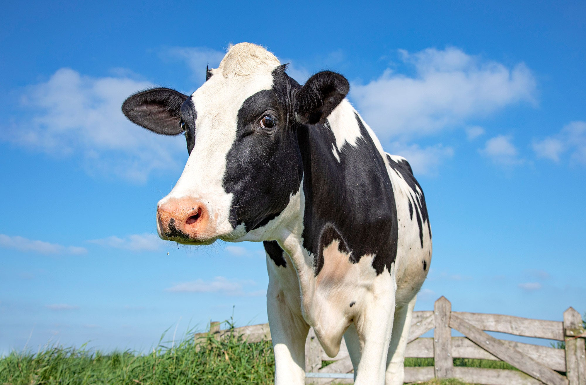

# Hands-on Tutorial: Quality Control, Population Structure, and Multi-Model GWAS

This tutorial walks through the bovine GWAS workflow used for the workshop. Run the commands in order and keep all generated output files in your own `~/workshop` directory unless otherwise stated.  
<sub>*For shorter commands, it is better to type out each command manually rather than copying directly. This helps you get accustomed to the bash and R environments.*</sub>
## Workflow overview

1. Quality control filtering on call rates and MAF.
2. Hardy-Weinberg equilibrium (HWE) analysis with full-distribution and zoomed-tail plots, followed by HWE filtering at `p < 1e-6`.
3. PCA calculation.
4. Scree plot generation, metadata PCA plots, covariate testing, and covariate-file export.
5. Whole-genome representation including chromosome X.
6. Association testing across six covariate models under additive, dominant, and recessive inheritance modes.
7. Standalone Manhattan plots for FDR-adjusted and nominal p-values, plus matching Q-Q plots with genomic inflation (`lambda`).


To login, use the following command in your terminal:
**_replace xx with your student number for example; student30, student01, .... etc_**

```bash
ssh -X -p 2222 studentXX@10.104.58.24
```

> **Working directory:** Before starting, make sure you are in your own workshop directory.
```bash
cd ~/workshop     # cd means change directory
pwd               # pwd means print working directoy
ls                # ls means list content
```

<details>
<summary><strong>Click to view some useful bash commands</strong></summary>

<br> 

Below is a list of useful commands 😏

```bash
# --- Navigation & Path Inspection ---
pwd                                 # Print the absolute path of the current working directory
cd my_folder                        # Change directory into 'my_folder'
cd ..                               # Move up one directory level (parent directory)
cd ~                                # Jump directly to your user's home directory
cd -                                # Switch back to the previous directory you were in

# --- Listing Files & Folders ---
ls                                  # List names of files and folders in the current directory
ls -l                               # Detailed list view showing permissions, owner, file size, and modification date
ls -lh                              # Detailed list view with human-readable file sizes (K, M, G)
ls -la                              # List all files, including hidden files and dotfiles (names starting with .)
ls -lt                              # List files sorted by last modified time (newest first)

# --- Viewing File Content ---
cat file.txt                        # Print the entire contents of file.txt to the terminal
less file.txt                       # Open a scrollable, paginated viewer (press 'q' to quit, '/' to search)
head file.txt                       # Display the first 10 lines of file.txt
head -n 25 file.txt                 # Display the first 25 lines of file.txt
tail file.txt                       # Display the last 10 lines of file.txt
tail -n 20 file.txt                 # Display the last 20 lines of file.txt
tail -f process.log                 # Follow file updates in real-time as new lines are appended

# --- File & Directory Management ---
mkdir new_folder                    # Create a new directory named 'new_folder'
mkdir -p path/to/nested/folder      # Create nested parent directories automatically without error
touch new_file.txt                  # Create an empty file or update the timestamp of an existing file
cp source.txt backup.txt            # Copy 'source.txt' to a new file called 'backup.txt'
cp -r folder_a folder_backup        # Recursively copy an entire folder and its contents
mv old_name.txt new_name.txt        # Rename a file or directory
mv file.txt /path/to/destination/   # Move a file to another location
rm unwanted_file.txt                # Permanently delete a file (no trash bin, cannot undo)
rm -r unwanted_folder               # Recursively delete a directory and all files inside it

# --- Searching & Inspection ---
wc -l file.txt                      # Count the total number of lines in file.txt
grep "pattern" file.txt             # Search and print lines containing 'pattern' in file.txt
grep -i "pattern" file.txt          # Case-insensitive search for 'pattern' in file.txt
grep -c "pattern" file.txt          # Count the number of lines matching 'pattern' in file.txt
find . -name "*.bed"                # Search the current directory recursively for files ending with .bed
which plink                         # Locate the executable path of a program in your system's PATH

# --- Pipes & Redirection ---
command > output.txt                # Run command and write its output to a file, overwriting existing content
command >> output.txt               # Run command and append its output to the end of a file
command1 | command2                 # Pipe: pass the stdout output of command1 directly into command2 as input
cat file.txt | grep "Chr1" | wc -l  # Count how many lines in file.txt contain "Chr1"

# --- System, Memory & Process Monitoring ---
df -h                               # Show available and used disk space across mounted filesystems
du -sh folder_name                  # Show the total disk space consumed by folder_name
free -h                             # Show total, used, and available system RAM memory
top                                 # Open an interactive monitor of CPU and RAM usage by running processes
htop                                # An enhanced, color-coded interactive process monitor (if installed)
kill 12345                          # Terminate the process with Process ID (PID) 12345
history                             # Display a numbered list of previously executed commands
clear                               # Clear terminal window output (shortcut: Ctrl + L)
```

</details>

The main genotype input used in this tutorial is:

```text
/workshop/data/SRD_HFL_AI_50K.ped
/workshop/data/SRD_HFL_AI_50K.map
```

The metadata file used later is:

```text
/workshop/data/SRD_HFL_AI_50K_metadata.csv
```

---

## 1. Initial Quality Control: Call Rate and MAF

This step applies the initial SNP- and animal-level QC filters and creates a binary PLINK dataset for downstream analyses.

First, check the version and help details for plink.

```bash
plink --version
plink --help
```

If the help output is too long, pipe the output to less, so you can scroll pages using the space bar, and use g/G to go to the first/Last page respectively. Use q to exit when you have finished viewing the file.

```bash
plink --help | less
```

Now that you have verified the version and viewed the help menu,

Run the following command:

```bash
plink \
    --file /workshop/data/SRD_HFL_AI_50K \
    --allow-no-sex \
    --maf 0.05 \
    --geno 0.10 \
    --mind 0.10 \
    --memory 4000 \
    --make-bed \
    --out srd_qc
```

### Oops! What happened? 🤭

What error message are you getting and why? Read the error message carefully.

**Question:** Why is PLINK having a problem with the chromosome numbers in this dataset?  


<details>
<summary><strong>Clue 🤔🧐</strong></summary>  
    
<details>
<summary><strong>Clue 🤔🧐</strong></summary>  
    
<p align="left">
  
  <br>
  <sub><i>Source: <a href="https://www.agdaily.com/livestock/facts-about-holstein-cattle-cows/">AGDAILY</a></i></sub>
</p>

</details>


<details>
<summary><strong>Click to reveal the solution 🤫</strong></summary>

<br>

By default, PLINK assumes that the dataset is **human**. Human autosomes are numbered 1–22, while cattle have **29 autosomes**.

We therefore need to tell PLINK that we are working with cattle by adding:

```bash
--cow
```

The corrected command is:

```bash
plink \
    --cow \
    --file /workshop/data/SRD_HFL_AI_50K \
    --allow-no-sex \
    --maf 0.05 \
    --geno 0.10 \
    --mind 0.10 \
    --memory 4000 \
    --make-bed \
    --out srd_qc
```

After adding `--cow`, PLINK recognizes the bovine chromosome set and the QC analysis can proceed. 😮‍💨

</details>

### Main output

```text
srd_qc.bed
srd_qc.bim
srd_qc.fam
srd_qc.log
```

---

## 2. Hardy-Weinberg Equilibrium and Post-HWE Filtering

First, calculate HWE statistics from the QC-filtered dataset.

```bash
plink \
    --bfile srd_qc \
    --hardy \
    --out plink_results_hwinb
```

If you got an error, click below

<details>
<summary><strong>Click here if you got an error</strong></summary>

<br> 

So you fell for this again eh? 🫣  

You might want to think through the error first, before peeking below 🧑‍💻🧠
</details>


<details>
<summary><strong>Do you want to reveal the correct code? 😏</strong></summary>

<br> 

OK, enough teasing, here is the correct code. Just add --cow. 🫩

```bash
plink \
    --cow \
    --bfile srd_qc \
    --hardy \
    --out plink_results_hwinb
```
</details>


The HWE results are written to:

```text
plink_results_hwinb.hwe
```

### Plot the HWE distribution in R

For a longer R block, it is usually easier to save the code in an R script instead of pasting it line-by-line into the R console.

Create a script with `nano`:

```bash
nano hwe_plots.R
```

Paste the R code below into the file. In `nano`, save with **Ctrl+O**, press **Enter**, then exit with **Ctrl+X**.

Run the completed script with:

```bash
Rscript hwe_plots.R
```

Alternatively, start an interactive R session with `R` and paste the same code directly.

```r
library(tidyverse)
library(patchwork)
library(scales)

hwe_raw <- read.table("plink_results_hwinb.hwe", header = TRUE, stringsAsFactors = FALSE)

if ("TEST" %in% colnames(hwe_raw)) {
  hwe_clean <- hwe_raw %>% filter(TEST == "ALL")
} else {
  hwe_clean <- hwe_raw
}

hwe_clean <- hwe_clean %>%
  filter(!is.na(P) & P >= 0 & P <= 1) %>%
  mutate(log10_P = -log10(ifelse(P == 0, 1e-50, P)))

n_failed <- sum(hwe_clean$P < 1e-6)

p_hwe_all <- ggplot(hwe_clean, aes(x = log10_P)) +
  geom_histogram(bins = 60, fill = "steelblue", color = "white", linewidth = 0.2) +
  geom_vline(xintercept = -log10(1e-6), color = "red", linetype = "dashed", linewidth = 0.9) +
  scale_y_continuous(
    trans = "pseudo_log",
    breaks = c(1, 10, 100, 1000, 10000, 50000),
    labels = trans_format("log10", math_format(10^.x))
  ) +
  annotate(
    "text",
    x = -log10(1e-6) + 0.8,
    y = 5000,
    label = paste0("p < 1e-6 Filter\n(", n_failed, " SNPs removed)"),
    color = "red",
    hjust = 0,
    fontface = "bold",
    size = 3.8
  ) +
  labs(
    title = "HWE Spectrum (Full Distribution)",
    subtitle = "Log10 y-axis highlights outlier departures",
    x = expression(-log[10](italic(p))),
    y = expression(Variant ~ Count ~ (log[10] ~ scale))
  ) +
  theme_bw(base_size = 12) +
  theme(
    plot.title = element_text(face = "bold", hjust = 0.5),
    plot.subtitle = element_text(hjust = 0.5, margin = margin(b = 10)),
    panel.grid.minor = element_blank()
  )

hwe_zoom_data <- hwe_clean %>% filter(log10_P >= 2)

p_hwe_zoom <- ggplot(hwe_zoom_data, aes(x = log10_P)) +
  geom_histogram(binwidth = 0.5, fill = "darkorange", color = "white", linewidth = 0.2) +
  geom_vline(xintercept = -log10(1e-6), color = "red", linetype = "dashed", linewidth = 0.9) +
  scale_y_continuous(expand = expansion(mult = c(0, 0.15))) +
  annotate(
    "rect",
    xmin = -log10(1e-6), xmax = Inf, ymin = 0, ymax = Inf,
    fill = "red", alpha = 0.1
  ) +
  annotate(
    "text",
    x = -log10(1e-6) + 0.5,
    y = max(table(cut_width(hwe_zoom_data$log10_P, 0.5))) * 0.85,
    label = "Excluded SNPs",
    color = "darkred",
    hjust = 0,
    fontface = "bold",
    size = 4
  ) +
  labs(
    title = expression(Zoomed ~ Cutoff ~ Breakage ~ (italic(p) <= 0.01)),
    subtitle = "Variants at the 1e-6 filter threshold",
    x = expression(-log[10](italic(p))),
    y = "Variant Count"
  ) +
  theme_bw(base_size = 12) +
  theme(
    plot.title = element_text(face = "bold", hjust = 0.5),
    plot.subtitle = element_text(hjust = 0.5, margin = margin(b = 10)),
    panel.grid.minor = element_blank()
  )

hwe_final_plot <- p_hwe_all + p_hwe_zoom
ggsave("hwe_distribution_plots.png", plot = hwe_final_plot, width = 13, height = 5.5, dpi = 300)
```

The plot is saved as:

```text
hwe_distribution_plots.png
```

Based on the plot, what threshold should be used for HWE?

### Apply the HWE filter

After reviewing the HWE distribution, apply the selected threshold:

```bash
plink \
    --cow \
    --bfile srd_qc \
    --hwe 1e-6 \
    --make-bed \
    --out srd_qc_hwe
```

### Main output

```text
srd_qc_hwe.bed
srd_qc_hwe.bim
srd_qc_hwe.fam
srd_qc_hwe.log
```

---

## 3. PCA Calculation

Calculate principal components from the post-HWE dataset.

```bash
plink \
    --cow \
    --bfile srd_qc_hwe \
    --pca \
    --out srd_pca
```

### Main output

```text
srd_pca.eigenval
srd_pca.eigenvec
```

---

## 4. PCA Scree Plot, Metadata PCA, Covariate Testing, and Export

This R section:

- calculates the percentage of variance explained by each PC;
- creates a PCA scree plot;
- joins PCA results to the workshop metadata;
- creates PCA plots colored by selected metadata variables;
- tests candidate covariates against the binary phenotype;
- exports a covariate file for the GWAS models.

Because this is a long block, save it as a script:

```bash
nano pca_covariates.R
```

Paste the code below, save with **Ctrl+O**, press **Enter**, and exit with **Ctrl+X**.

Run it with:

```bash
Rscript pca_covariates.R
```

```r
library(tidyverse)

eigenvalues <- read.table("srd_pca.eigenval", header = FALSE)$V1
var_explained <- (eigenvalues / sum(eigenvalues)) * 100

scree_df <- data.frame(
  PC = factor(paste0("PC", seq_along(eigenvalues)), levels = paste0("PC", seq_along(eigenvalues))),
  PC_num = seq_along(eigenvalues),
  Variance = var_explained,
  Cumulative = cumsum(var_explained)
)

scree_plot <- ggplot(scree_df, aes(x = PC_num)) +
  geom_bar(aes(y = Variance), stat = "identity", fill = "steelblue", alpha = 0.85) +
  geom_line(aes(y = Variance), color = "darkblue", linewidth = 1) +
  geom_point(aes(y = Variance), color = "darkblue", size = 2) +
  scale_x_continuous(breaks = seq_along(eigenvalues)) +
  theme_bw(base_size = 14) +
  labs(
    title = "PCA Scree Plot",
    x = "Principal Component",
    y = "% Variance Explained"
  ) +
  theme(plot.title = element_text(hjust = 0.5, face = "bold"))

ggsave("pca_scree_plot.png", plot = scree_plot, width = 8, height = 5, dpi = 300)

pca_data <- read.table("srd_pca.eigenvec", header = FALSE)
colnames(pca_data)[1:2] <- c("FID", "IID")
num_pcs <- ncol(pca_data) - 2
colnames(pca_data)[3:ncol(pca_data)] <- paste0("PC", 1:num_pcs)

metadata <- read.csv("/workshop/data/SRD_HFL_AI_50K_metadata.csv", stringsAsFactors = FALSE)

metadata <- metadata %>%
  mutate(
    Birth_Year_Label = ifelse(as.numeric(Birth_Year) >= 2020, "Post-2020", "Pre-2020"),
    Birth_Year_Group = ifelse(as.numeric(Birth_Year) >= 2020, 2, 1)
  )

fam_data <- read.table("srd_qc_hwe.fam", header = FALSE)[, c(1, 2, 6)]
colnames(fam_data) <- c("FID", "IID", "Phenotype")

plot_data <- inner_join(pca_data, metadata, by = c("IID" = "SampleID")) %>%
  inner_join(fam_data, by = c("FID", "IID")) %>%
  mutate(
    Pheno_Binary = case_when(
      Phenotype == 2 ~ 1,
      Phenotype == 1 ~ 0,
      TRUE ~ NA_real_
    )
  )

variables_to_plot <- list(
  "Sire"              = "Sire ID",
  "Birth_Year"        = "Birth Year",
  "Birth_Year_Label"  = "Birth Year Grouping (Pre vs Post 2020)",
  "Technician"        = "Technician ID",
  "Protocol"          = "Protocol"
)

pc1_var <- round(var_explained[1], 2)
pc2_var <- round(var_explained[2], 2)

for (var_name in names(variables_to_plot)) {
  legend_title <- variables_to_plot[[var_name]]
  plot_data[[var_name]] <- as.factor(plot_data[[var_name]])

  pca_plot <- ggplot(plot_data, aes(x = PC1, y = PC2, color = .data[[var_name]])) +
    geom_point(alpha = 0.8, size = 2.5) +
    theme_bw(base_size = 14) +
    labs(
      title = paste("Cattle Population PCA -", legend_title),
      x = paste0("PC1 (", pc1_var, "% variance)"),
      y = paste0("PC2 (", pc2_var, "% variance)"),
      color = legend_title
    ) +
    theme(
      plot.title = element_text(hjust = 0.5, face = "bold"),
      panel.grid.minor = element_blank()
    )

  out_name <- ifelse(var_name == "Birth_Year_Label", "srd_pca_Birth_Year_Group.jpg", paste0("srd_pca_", var_name, ".jpg"))

  ggsave(
    filename = out_name,
    plot = pca_plot,
    width = 9,
    height = 6,
    dpi = 300
  )
}

test_vars <- c("Birth_Year", "Birth_Year_Group", "Technician", "Sire", "Protocol", "PC1", "PC2", "PC3")

covar_results <- list()

for (v in test_vars) {
  sub_df <- plot_data %>% filter(!is.na(Pheno_Binary) & !is.na(.data[[v]]))
  n_unique <- length(unique(sub_df[[v]]))

  if (n_unique < 2) {
    covar_results[[v]] <- data.frame(
      Covariate = v,
      Type = "Constant/Single-Level",
      Df = 0,
      Deviance = 0,
      P_Value = NA_real_,
      Significant_05 = "NO (Invariable)"
    )
    next
  }

  is_cat <- is.factor(sub_df[[v]]) || is.character(sub_df[[v]])
  var_type <- ifelse(is_cat, paste0("Factor (", n_unique, " levels)"), "Numeric")

  null_mod <- glm(Pheno_Binary ~ 1, data = sub_df, family = binomial)
  cand_formula <- as.formula(paste("Pheno_Binary ~", v))
  cand_mod <- glm(cand_formula, data = sub_df, family = binomial)

  lrt <- anova(null_mod, cand_mod, test = "Chisq")
  p_val <- lrt$`Pr(>Chi)`[2]
  dev_diff <- round(lrt$Deviance[2], 3)
  df_diff <- lrt$Df[2]

  covar_results[[v]] <- data.frame(
    Covariate = v,
    Type = var_type,
    Df = df_diff,
    Deviance = dev_diff,
    P_Value = signif(p_val, 4),
    Significant_05 = ifelse(!is.na(p_val) & p_val < 0.05, "YES", "NO")
  )
}

covar_stats <- bind_rows(covar_results)
cat("\n=== Covariate Association with Phenotype (Likelihood Ratio Test) ===\n")
print(covar_stats)
write.csv(covar_stats, "covariate_statistical_tests.csv", row.names = FALSE)

sub_pcs <- plot_data %>% filter(!is.na(Pheno_Binary) & !is.na(PC1) & !is.na(PC2))
null_pcs <- glm(Pheno_Binary ~ 1, data = sub_pcs, family = binomial)
joint_pcs <- glm(Pheno_Binary ~ PC1 + PC2, data = sub_pcs, family = binomial)
lrt_pcs <- anova(null_pcs, joint_pcs, test = "Chisq")

cat("\n=== Joint Test: Phenotype ~ PC1 + PC2 ===\n")
cat("P-value:", signif(lrt_pcs$`Pr(>Chi)`[2], 4), "\n\n")

covar_df <- inner_join(
  pca_data[, c("FID", "IID", "PC1", "PC2")],
  plot_data[, c("IID", "Birth_Year", "Birth_Year_Group", "Technician", "Sire")],
  by = "IID"
)

write.table(covar_df, "covariates.txt", row.names = FALSE, col.names = TRUE, quote = FALSE, sep = "\t")
```

If you used an interactive R session instead of `Rscript`, exit without saving the workspace:
```r
q("no")    # You can also use Ctrl + d and when prompted to save workplace, type n.
```

### Main outputs

```text
pca_scree_plot.png
srd_pca_Sire.jpg
srd_pca_Birth_Year.jpg
srd_pca_Birth_Year_Group.jpg
srd_pca_Technician.jpg
srd_pca_Protocol.jpg
covariate_statistical_tests.csv
covariates.txt
```

---

## 5. Enable Whole-Genome Testing: Autosomes + Chromosome X

Create the dataset used for the association models.

```bash
plink \
    --bfile srd_qc_hwe \
    --autosome-num 30 \
    --allow-extra-chr \
    --make-bed \
    --out srd_qc_allchr
```

Wait, why did it work 😲? Something looks different here, what is it? 🤔

<details>
<summary><strong>Clue 🤔🧐</strong></summary>

<video src="https://github.com/user-attachments/assets/5ac3ef17-9b6f-49af-b706-ac3de99d2182" controls width="100%"></video>

<sub><i>Source: <a href="https://www.tiktok.com/t/ZTUFuSbBq">TikTok</a></i></sub>

</details>

### Main output

```text
srd_qc_allchr.bed
srd_qc_allchr.bim
srd_qc_allchr.fam
```

---

## 6. Multi-Model Association Testing

The loop below runs six covariate configurations under three inheritance models:

- Additive
- Dominant
- Recessive

The six GWAS configurations are:

1. Unadjusted
2. Birth year
3. Birth year group
4. Technician
5. PC1 + PC2
6. Sire

Run the complete Bash loop as one block:

```bash
for cov in "unadjusted" "birth_year" "birth_year_group" "technician" "pc1_pc2" "sire"; do
  cov_args=""
  if [ "$cov" = "birth_year" ];       then cov_args="--covar covariates.txt --covar-name Birth_Year"; fi
  if [ "$cov" = "birth_year_group" ]; then cov_args="--covar covariates.txt --covar-name Birth_Year_Group"; fi
  if [ "$cov" = "technician" ];       then cov_args="--covar covariates.txt --covar-name Technician"; fi
  if [ "$cov" = "pc1_pc2" ];          then cov_args="--covar covariates.txt --covar-name PC1,PC2"; fi
  if [ "$cov" = "sire" ];             then cov_args="--covar covariates.txt --covar-name Sire"; fi

  # 1. Additive Model
  plink --bfile srd_qc_allchr --autosome-num 30 --allow-no-sex --logistic hide-covar $cov_args --out "gwas_${cov}_ADD"

  # 2. Dominant Model
  plink --bfile srd_qc_allchr --autosome-num 30 --allow-no-sex --logistic dominant hide-covar $cov_args --out "gwas_${cov}_DOM"

  # 3. Recessive Model
  plink --bfile srd_qc_allchr --autosome-num 30 --allow-no-sex --logistic recessive hide-covar $cov_args --out "gwas_${cov}_REC"
done
```

This produces `.assoc.logistic` files for each covariate/inheritance-model combination.

---

## 7. Generate Standalone Manhattan and Q-Q Plots

This section generates:

- FDR Manhattan plots with a red dashed line at `FDR < 0.05`;
- nominal Manhattan plots with a red dashed line at `p < 1e-5`;
- Q-Q plots with genomic inflation (`lambda`) displayed on each plot.

Save the plotting code as an R script:

```bash
nano gwas_plots.R
```

Paste the code below, save with **Ctrl+O**, press **Enter**, and exit with **Ctrl+X**.

Run it with:

```bash
Rscript gwas_plots.R
```

```r
library(tidyverse)
library(scales)

plot_single_manhattan <- function(df_model, model_name, run_title, out_png, mode = c("FDR", "Nominal")) {
  mode <- match.arg(mode)

  chr_info <- df_model %>%
    distinct(CHR, BP) %>%
    group_by(CHR) %>%
    summarise(chr_len = max(as.numeric(BP)), .groups = "drop") %>%
    arrange(CHR) %>%
    mutate(tot = lag(cumsum(as.numeric(chr_len)), default = 0))

  df_plot <- df_model %>%
    left_join(chr_info %>% select(CHR, tot), by = "CHR") %>%
    mutate(BP_cum = as.numeric(BP) + tot)

  axis_df <- df_plot %>%
    group_by(CHR_LABEL, CHR) %>%
    summarize(center = (max(BP_cum) + min(BP_cum)) / 2, .groups = "drop") %>%
    arrange(CHR)

  shade_rects <- chr_info %>%
    filter(CHR %% 2 == 0) %>%
    mutate(xmin = tot, xmax = tot + chr_len)

  N_samples  <- if ("NMISS" %in% colnames(df_model)) max(df_model$NMISS, na.rm = TRUE) else 126
  n_snps     <- nrow(df_model)
  chisq      <- qchisq(1 - df_model$P, df = 1)
  lambda_val <- round(median(chisq, na.rm = TRUE) / qchisq(0.5, df = 1), 3)

  if (mode == "FDR") {
    df_plot$y_val <- df_plot$log10_FDR
    cutoff_y <- -log10(0.05)
    sig_count <- sum(df_plot$FDR < 0.05, na.rm = TRUE)
    subtitle_text <- "Red dashed line: FDR < 0.05"
    y_axis_label <- expression(-log[10](FDR))
    label_text <- paste0(
      "N = ", comma(N_samples),
      " | SNPs = ", comma(n_snps),
      " | lambda = ", lambda_val,
      " | FDR < 0.05: ", sig_count
    )
  } else {
    df_plot$y_val <- df_plot$log10_P
    cutoff_y <- -log10(1e-5)
    sig_count <- sum(df_plot$P < 1e-5, na.rm = TRUE)
    subtitle_text <- "Red dashed line: Nominal p < 1e-5"
    y_axis_label <- expression(-log[10](italic(p)))
    label_text <- paste0(
      "N = ", comma(N_samples),
      " | SNPs = ", comma(n_snps),
      " | lambda = ", lambda_val,
      " | p < 1e-5: ", sig_count
    )
  }

  p <- ggplot() +
    geom_rect(
      data = shade_rects,
      aes(xmin = xmin, xmax = xmax, ymin = -Inf, ymax = Inf),
      fill = "grey93", alpha = 0.6, inherit.aes = FALSE
    ) +
    geom_point(
      data = df_plot,
      aes(x = BP_cum, y = y_val, color = as.factor(CHR %% 10)),
      alpha = 0.75, size = 1.3
    ) +
    geom_hline(yintercept = cutoff_y, color = "red", linetype = "dashed", linewidth = 0.7) +
    annotate(
      "text",
      x = -Inf, y = Inf,
      label = label_text,
      hjust = -0.02, vjust = 1.6,
      size = 4, fontface = "bold"
    ) +
    scale_x_continuous(
      labels = axis_df$CHR_LABEL,
      breaks = axis_df$center,
      expand = expansion(mult = c(0.01, 0.01))
    ) +
    scale_y_continuous(expand = expansion(mult = c(0.02, 0.15))) +
    scale_color_brewer(palette = "Paired", guide = "none") +
    labs(
      title = paste0(run_title, " Manhattan Plot: ", model_name, " Model (", mode, ")"),
      subtitle = subtitle_text,
      x = "Chromosome",
      y = y_axis_label
    ) +
    theme_bw(base_size = 13) +
    theme(
      plot.title = element_text(face = "bold", hjust = 0),
      plot.subtitle = element_text(size = 11, hjust = 0, margin = margin(b = 6)),
      panel.grid.minor = element_blank(),
      panel.grid.major.x = element_blank(),
      axis.text.x = element_text(size = 8.5, vjust = 0.5)
    )

  ggsave(out_png, plot = p, width = 11, height = 5.5, dpi = 300)
}

plot_single_qq <- function(pvals, model_name, run_title, out_png) {
  pvals <- na.omit(pvals)
  pvals <- pvals[pvals > 0 & pvals <= 1]
  n <- length(pvals)

  obs <- -log10(sort(pvals, decreasing = FALSE))
  exp <- -log10(ppoints(n))

  chisq <- qchisq(1 - pvals, df = 1)
  lambda_val <- round(median(chisq, na.rm = TRUE) / qchisq(0.5, df = 1), 3)

  qq_data <- data.frame(Observed = obs, Expected = exp)
  max_val <- ceiling(max(c(obs, exp)))

  p <- ggplot(qq_data, aes(x = Expected, y = Observed)) +
    geom_point(color = "steelblue", alpha = 0.6, size = 2) +
    geom_abline(intercept = 0, slope = 1, color = "red", linetype = "dashed", linewidth = 0.8) +
    annotate(
      "text",
      x = max_val * 0.78,
      y = max_val * 0.95,
      label = paste0("lambda == ", lambda_val),
      parse = TRUE,
      size = 5.5,
      fontface = "bold"
    ) +
    coord_cartesian(xlim = c(0, max_val), ylim = c(0, max_val)) +
    labs(
      title = paste0(run_title, " Q-Q Plot: ", model_name, " Model"),
      x = expression(Expected ~ -log[10](italic(p))),
      y = expression(Observed ~ -log[10](italic(p)))
    ) +
    theme_bw(base_size = 13) +
    theme(
      plot.title = element_text(face = "bold", hjust = 0.5),
      panel.grid.minor = element_blank()
    )

  ggsave(out_png, plot = p, width = 6, height = 6, dpi = 300)
}

runs <- list(
  list(prefix = "gwas_unadjusted",        tag = "unadjusted",        title = "Unadjusted"),
  list(prefix = "gwas_birth_year",        tag = "birth_year",        title = "Birth Year"),
  list(prefix = "gwas_birth_year_group",  tag = "birth_year_group",  title = "Birth Year Grouping"),
  list(prefix = "gwas_technician",        tag = "technician",        title = "Technician"),
  list(prefix = "gwas_pc1_pc2",           tag = "pc1_pc2",           title = "PC1 + PC2"),
  list(prefix = "gwas_sire",              tag = "sire",              title = "Sire")
)

models <- list(
  list(suffix = "_ADD.assoc.logistic", test_id = "ADD", name = "Additive",   short = "add"),
  list(suffix = "_DOM.assoc.logistic", test_id = "DOM", name = "Dominant",   short = "dom"),
  list(suffix = "_REC.assoc.logistic", test_id = "REC", name = "Recessive",  short = "rec")
)

for (r in runs) {
  for (m in models) {
    file_path <- paste0(r$prefix, m$suffix)
    if (!file.exists(file_path)) {
      warning(paste("File missing:", file_path))
      next
    }

    cat("Plotting:", r$title, "-", m$name, "\n")

    df <- read.table(file_path, header = TRUE, stringsAsFactors = FALSE) %>%
      filter(TEST == m$test_id) %>%
      filter(!is.na(P) & P > 0 & P <= 1) %>%
      mutate(
        CHR_LABEL = ifelse(CHR == 30, "X", as.character(CHR)),
        CHR = as.numeric(CHR),
        log10_P = -log10(P),
        FDR = p.adjust(P, method = "BH"),
        log10_FDR = -log10(FDR)
      ) %>%
      filter(CHR >= 1 & CHR <= 30)

    plot_single_manhattan(
      df_model = df,
      model_name = m$name,
      run_title = r$title,
      out_png = paste0("manhattan_fdr_", r$tag, "_", m$short, ".png"),
      mode = "FDR"
    )

    plot_single_manhattan(
      df_model = df,
      model_name = m$name,
      run_title = r$title,
      out_png = paste0("manhattan_nominal_", r$tag, "_", m$short, ".png"),
      mode = "Nominal"
    )

    plot_single_qq(
      pvals = df$P,
      model_name = m$name,
      run_title = r$title,
      out_png = paste0("qq_", r$tag, "_", m$short, ".png")
    )
  }
}
```

### Plot outputs

The script creates one FDR Manhattan plot, one nominal Manhattan plot, and one Q-Q plot for every covariate/inheritance-model combination.

Examples:

```text
manhattan_fdr_unadjusted_add.png
manhattan_nominal_unadjusted_add.png
qq_unadjusted_add.png
```

The same naming pattern is used for the remaining covariate and inheritance models.

---

## Quick command summary

| Step | Main command/script | Main output |
|---|---|---|
| Initial QC | `plink --file ... --maf --geno --mind --make-bed` | `srd_qc.*` |
| HWE calculation | `plink --bfile srd_qc --hardy` | `plink_results_hwinb.hwe` |
| HWE plots | `Rscript hwe_plots.R` | `hwe_distribution_plots.png` |
| HWE filtering | `plink --bfile srd_qc --hwe 1e-6 --make-bed` | `srd_qc_hwe.*` |
| PCA | `plink --bfile srd_qc_hwe --pca` | `srd_pca.eigenval`, `srd_pca.eigenvec` |
| PCA/covariates | `Rscript pca_covariates.R` | PCA plots, `covariates.txt` |
| Whole-genome dataset | `plink ... --autosome-num 30 ...` | `srd_qc_allchr.*` |
| GWAS models | Bash `for` loop | `.assoc.logistic` files |
| Manhattan/Q-Q plots | `Rscript gwas_plots.R` | `.png` plots |

## Notes for students ✍️📖

- Run commands from your own `~/workshop` directory so your output files stay separate from other students' work.
- Read the PLINK `.log` file after every major PLINK command. It records how many animals and SNPs were loaded, removed, and retained.
- Do not delete intermediate files until the workflow is complete; later steps depend on several of them.
- When using `nano`, save with **Ctrl+O**, press **Enter**, and exit with **Ctrl+X**.
- If an R script stops with an error, read the first error message before rerunning the script. Later errors may simply be consequences of the first one.

## The End! :grin: :clap:
<p align="center">
  
  <br>
  <sub><i>Source: <a href="https://www.pinterest.com/pin/55239532918424769/">Pinterest</a></i></sub>
</p>
